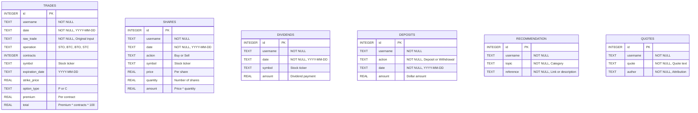

# Options Trading Bot - Database Schema

## Schema Diagram



## Table Descriptions

### 📊 Core Trading Tables

#### **TRADES** - Options Trading Activity
Primary table for options trades (STO, BTC, BTO, STC operations).

**Key Fields:**
- `operation`: Trade type (Sell-to-Open, Buy-to-Close, etc.)
- `contracts`: Number of option contracts
- `strike_price` + `option_type`: Strike price and Put/Call
- `expiration_date`: Option expiration
- `premium`: Price per contract
- `total`: Total premium (contracts × premium × 100)

**Example Record:**
```sql
INSERT INTO trades VALUES (
    1, 'user123', '2025-01-15', 'STO 2x AAPL 1/31 150P @ 2.50',
    'STO', 2, 'AAPL', '2025-01-31', 150.0, 'P', 2.50, 500.0
);
```

#### **SHARES** - Stock Buy/Sell Transactions
Tracks stock purchases and sales.

**Key Fields:**
- `action`: "Buy" or "Sell"
- `quantity`: Number of shares (can be fractional)
- `price`: Price per share
- `amount`: Total transaction value

**Example Record:**
```sql
INSERT INTO shares VALUES (
    1, 'user123', '2025-01-15', 'Buy', 'TSLA', 250.00, 10, 2500.00
);
```

#### **DIVIDENDS** - Dividend Payments
Tracks dividend income by symbol and date.

**Example Record:**
```sql
INSERT INTO dividends VALUES (
    1, 'user123', '2025-01-15', 'AAPL', 150.50
);
```

#### **DEPOSITS** - Account Cash Flow
Tracks deposits and withdrawals from trading accounts.

**Key Fields:**
- `action`: "Deposit" or "Withdrawal"
- `amount`: Dollar amount

**Example Record:**
```sql
INSERT INTO deposits VALUES (
    1, 'user123', 'Deposit', '2025-01-15', 10000.00
);
```

### 📝 Supporting Tables

#### **RECOMMENDATION** - Team Recommendations
Stores trading ideas and references shared by team members.

**Fields:**
- `topic`: Category or subject
- `reference`: URL or description

#### **QUOTES** - Inspirational Quotes
Stores quotes for display in Discord bot.

**Fields:**
- `quote`: Quote text
- `author`: Attribution

---

## Data Relationships

### User-Centric Design
All tables use `username` (TEXT) as the foreign key concept, though not enforced with constraints. This allows:
- Multi-user support in Discord bot
- User-specific queries and reports
- Data isolation per user

### Common Patterns

**Date Format:**
- All dates stored as TEXT in ISO 8601 format: `YYYY-MM-DD`
- Consistent across all tables for easy querying

**Primary Keys:**
- All tables use auto-incrementing INTEGER `id` as primary key
- Sequential IDs for simple record identification

**Nullable Fields:**
- Most tables allow NULL in descriptive fields
- `username`, `date`, and `action` fields are NOT NULL

---

## Query Patterns

### Common Queries

**Get all trades for a user:**
```sql
SELECT * FROM trades WHERE username = ? ORDER BY date DESC;
```

**Calculate total profit from closed options:**
```sql
SELECT
    symbol,
    SUM(CASE WHEN operation = 'STO' THEN total
             WHEN operation = 'BTC' THEN -total END) as profit
FROM trades
WHERE username = ? AND operation IN ('STO', 'BTC')
GROUP BY symbol;
```

**Get dividend income by month:**
```sql
SELECT
    strftime('%Y-%m', date) as month,
    SUM(amount) as total_dividends
FROM dividends
WHERE username = ?
GROUP BY month;
```

**Portfolio value from shares:**
```sql
SELECT
    symbol,
    SUM(CASE WHEN action = 'Buy' THEN quantity
             WHEN action = 'Sell' THEN -quantity END) as net_shares
FROM shares
WHERE username = ?
GROUP BY symbol
HAVING net_shares > 0;
```

---

## Data Import Sources

The database supports CSV imports from multiple brokerages:

### Supported Brokerages
1. **Fidelity** - Full support for options, shares, dividends, deposits
2. **Robinhood** - Full support for all transaction types
3. **Schwab** - Full support for all transaction types
4. **Interactive Brokers (IBKR)** - Full support for all transaction types

### Import Process
1. Auto-detect brokerage format using `bot_upload_identifier.py`
2. Parse CSV with brokerage-specific processor
3. Extract date range from transactions
4. Delete existing records in date range (prevent duplicates)
5. Insert new records
6. Generate summary statistics

---

## Database File
- **Location**: `trades.db` (SQLite)
- **Creation**: Automatic on first run
- **Backup**: Recommended before major imports

---

## Statistics and Reporting

The database supports comprehensive analytics:

### Available Reports
- **Profit Summary** - Total P&L by symbol
- **Symbol Detail** - Complete trading history for a symbol
- **Team Statistics** - Aggregated metrics across users
- **Operation Statistics** - Breakdown by trade type (STO, BTC, etc.)
- **Time-based Analysis** - Week, month, year-to-date metrics

### Data Processing
- Raw SQL queries via `db.py`
- Pandas DataFrames via `df_stats.py`
- Export to CSV, PDF reports
